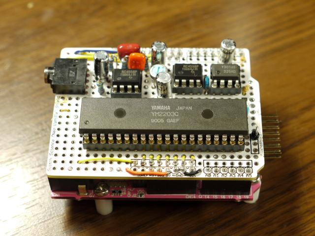

# FM Shield

## 概要
GR-SAKURAでFM音源YM2203を制御するシールド基板とソースコード(ライブラリおよびサンプルアプリ)です。ライブラリはMMLの文字列データを再生します。MMLの仕様はN88-BASICのMMLのサブセットです。

## デモ動画

## ファイル一覧

* FM_Shield.pdf : 回路図
* FM_Shield_BSch : 回路図 (BSch用データ)
* FM_Shield_src : ソース (GR-SAKURA用)
* oh_fmongen_ntk2014.pdf : Oh!FM音源 (薄い本)
  * 特集1: FM音源の基礎とYM2203
  * GR-SAKURA用シールド
